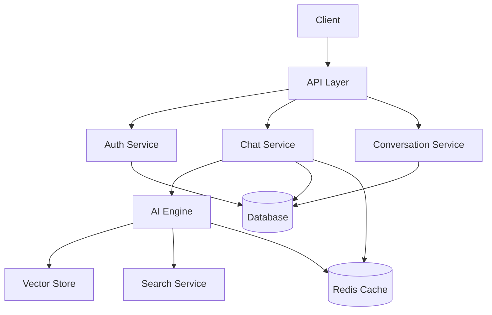
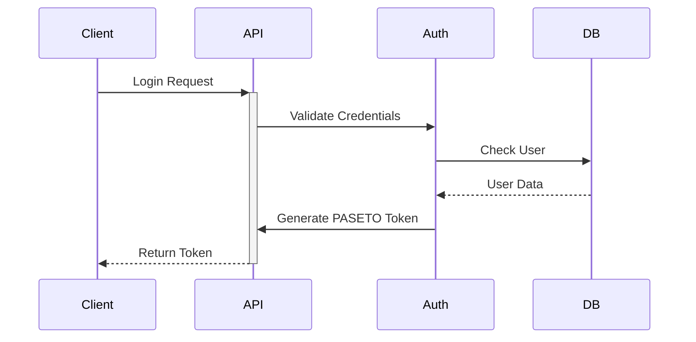

# GigaChat Architecture

## System Overview

GigaChat is a FastAPI-based chat application with AI integration, providing secure, scalable, and extensible conversational capabilities.



## Core Components

### 1. API Layer (`app/api/`)
- FastAPI routes and endpoints
- Request/response models
- Input validation
- Authentication middleware
- Rate limiting

### 2. Core Services (`app/core/`)
- **AI Engine**: LLM integration, context management
- **Security**: Auth, encryption, RBAC
- **Database**: SQLAlchemy models, migrations
- **Cache**: Redis integration
- **Storage**: MinIO file handling

### 3. Models (`app/models/`)
- SQLAlchemy ORM models
- Pydantic schemas
- Data validation
- Type safety

### 4. Frontend (`app/frontend/`)
- Template-based UI
- Static assets
- Client-side logic
- Accessibility features

## Data Flow

1. **Authentication Flow**


2. **Chat Flow**
```mermaid
sequenceDiagram
    Client->>+API: Send Message
    API->>Auth: Validate Token
    API->>Chat: Process Message
    Chat->>AI: Generate Response
    AI->>Vector: Get Context
    AI->>Search: Web Search
    AI-->>Chat: Combined Response
    Chat->>DB: Save Conversation
    Chat-->>-Client: Return Response
```

## Security Architecture

### Authentication
- PASETO tokens (no JWT)
- Bcrypt + pepper for passwords
- Rate limiting
- Account lockout
- 2FA support

### Authorization
- Role-based access control
- Resource-level permissions
- Scoped tokens
- Audit logging

### Data Protection
- Encrypted storage
- Input validation
- SQL injection protection
- XSS prevention
- CORS security

## Scalability

### Horizontal Scaling
- Stateless API design
- Redis for session store
- Distributed caching
- Load balancer ready

### Performance
- Response caching
- Database connection pooling
- Async operations
- Efficient vector search

## Monitoring & Observability

### Metrics
- Request latency
- Error rates
- Cache hit rates
- Database performance

### Logging
- Structured JSON logs
- Log levels
- Correlation IDs
- Audit trails

### Tracing
- OpenTelemetry integration
- Request tracing
- Performance profiling
- Dependency mapping

## Development Workflow

### Local Development
1. Clone repository
2. Run bootstrap script
3. Start dependencies
4. Run development server

### Testing
1. Unit tests
2. Integration tests
3. End-to-end tests
4. Performance tests

### Deployment
1. Build Docker image
2. Run security scans
3. Deploy with Docker Compose
4. Verify monitoring

## Integration Points

### External Services
- MinIO (S3 storage)
- Redis (caching)
- MySQL (database)
- SearxNG (search)

### APIs
- Authentication API
- Chat API
- Conversation API
- File Upload API

## Configuration Management

### Environment Variables
- Application settings
- Service credentials
- Feature flags
- Environment-specific configs

### Service Discovery
- DNS-based discovery
- Health checks
- Circuit breakers
- Fallback mechanisms

## Future Considerations

### Planned Features
- WebSocket support
- Streaming responses
- Plugin system
- Multi-model support

### Scalability Improvements
- Message queue
- Read replicas
- Sharding strategy
- CDN integration